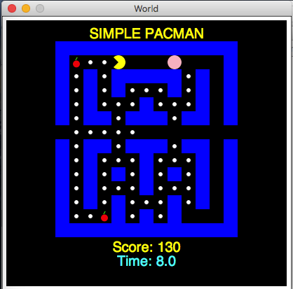

# rkt-pacman
A simple pacman game written in Racket.
To run the game:

* The pacman.dmg file can be downloaded and run directly on a Mac.
* Open pacman.rkt and run in [Dr. Racket](https://docs.racket-lang.org/drracket)

## Screenshot

Based on lab material of the course [CPSC 110](https://sites.google.com/site/ubccpsc110/) offered at [UBC](http://www.ubc.ca)
